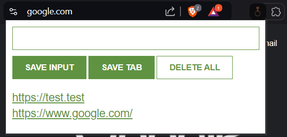

# Link Grabber Chrome Extension


A Chrome extension that allows users to grab and store links either manually or automatically, displaying them in the extension popup. The stored data is saved locally and can be deleted with a double confirmation.

## Features

- **Manual Input:** Users can input any text into the textbox and save it by clicking the "SAVE INPUT" button. This input is then displayed and saved to `localStorage`.
- **Automatic Tab URL Grabber:** Clicking the "SAVE TAB" button grabs the URL of the current tab in the current window, displays it, and saves it to `localStorage`.
- **Delete All Data:** Clicking the "DELETE ALL" button twice clears all stored data from the display and `localStorage`.

## How to Use

1. **Save Input:**  
   - Write any custom text into the textbox.
   - Click the "SAVE INPUT" button to display it in the list below and store it in localStorage.

2. **Save Current Tab URL:**  
   - Click the "SAVE TAB" button to automatically grab the current tab URL, display it, and store it in localStorage.

3. **Delete All Links:**  
   - Click the "DELETE ALL" button **twice** to clear both the displayed data and the localStorage.

## Files

### `manifest.json`
This file defines the extension's metadata, permissions, and background logic.

### `index.html`
The HTML file that contains the structure for the extension's popup, including:
- A text input field
- "SAVE INPUT", "SAVE TAB", and "DELETE ALL" buttons
- A display area for showing stored links

### `index.js`
The JavaScript logic that handles:
- Retrieving and saving data to `localStorage`
- Displaying links in the popup
- Managing the deletion of all data upon double-click of the "DELETE ALL" button

### `index.css`
The external CSS file that contains the styling for the popup, including layout and button designs.

## Installation

1. Clone or download this repository.
     ```bash
   git clone https://github.com/graycracker1/link-grabber-chrome-extension.git
2. Open Chrome and navigate to `chrome://extensions/`.
3. Enable **Developer mode** (top-right corner).
4. Click **Load unpacked** and select the directory containing this extension.
5. The extension will now appear in your browser's extensions bar.

## Output

# 1.

